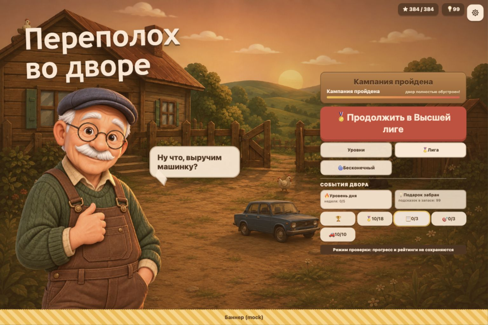
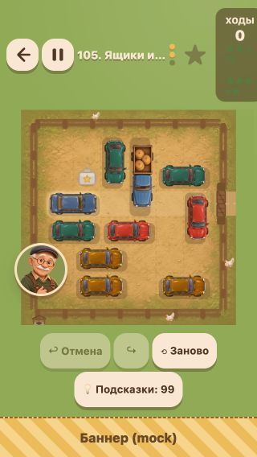
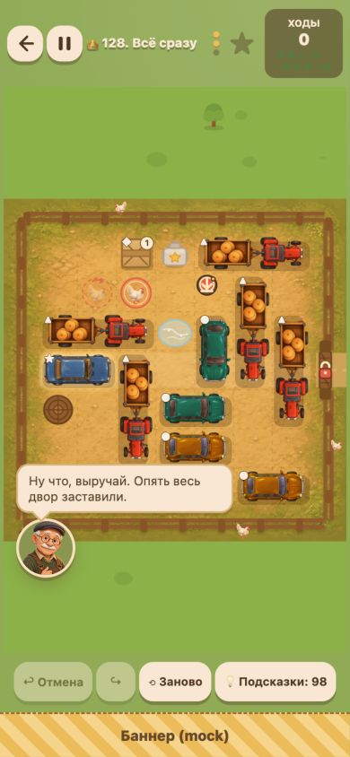
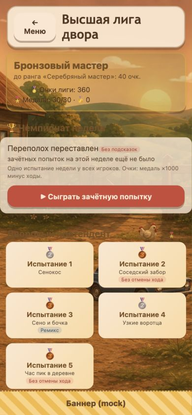
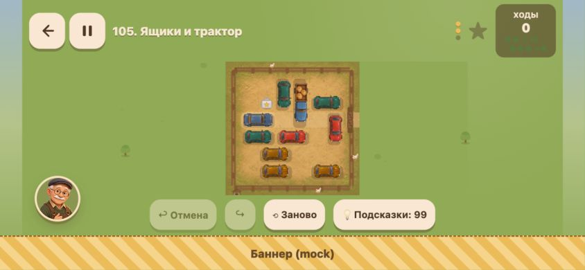

# Потребительский аудит «Переполох во дворе»

Дата: 8 сентября 2026. Проверена текущая незакоммиченная версия проекта.
Основание: [промпт аудита](CONSUMER_AUDIT_PROMPT.md). Аудит проведён по реальным экранам и ручному вводу; причины отдельных дефектов сверены с исходниками. Реализация игры в ходе этого аудита не изменялась.

## Вердикт

**Игра уже даёт понятное удовольствие от освобождения машинки, но визуально и по удобству ещё не выглядит завершённым продуктом.** На первых уровнях хочется продолжить: цель проста, перетаскивание понятно, отмена позволяет экспериментировать. Главные потери качества находятся вокруг этой основы: нечитаемые условия звёзд, перекрытие поля репликами, разные художественные стили и пропавшее визуальное развитие двора на больших экранах.

Самая серьёзная находка — **на desktop/tablet обновление двора скрыто постоянной иллюстрацией**. Игрок получает сообщение о благоустройстве, но не видит обещанного изменения. Предыдущая узкая проверка соответствия картинке это пропустила: наличие объектов прогресса в DOM не означает, что игрок их видит.

Сводка: **15 записей — 7 подтверждённых дефектов/расхождений и 8 проблем UX или художественной подачи.** Приоритеты: 1 × P1, 11 × P2, 3 × P3. P0 в проверенных сценариях не обнаружен. Это реестр найденного, а не доказательство отсутствия других багов.

Публичный выпуск текущего визуального обновления рекомендую отложить до исправления P1 и основных проблем читаемости. Внутренний плейтест уже полезен.

## Экспертная оценка

Оценки отражают этот просмотр одним аудитором; это не результаты исследования аудитории.

| Область | Оценка | Обоснование |
|---|---:|---|
| Первое впечатление desktop | 7/10 | Тёплая иллюстрация и выразительный дед; главный CTA заметен |
| Первое впечатление mobile | 5/10 | Более примитивная сцена, герой исчезает, нет качества desktop-композиции |
| Качество отдельных иллюстраций | 8/10 | Приятный свет, транспорт объёмный; явного растяжения на осмотренных полях нет |
| Визуальная целостность | 4/10 | Растровая земля/машины, плоские предметы, emoji и старый SVG-двор выглядят разными наборами |
| Читаемость головоломки | 4/10 | HUD теряется, сетка слаба, реплики перекрывают фигуры, landscape слишком мелкий |
| Управление в проверенных сценариях | 7/10 | Drag, undo/redo, pause, restart работают; физический touch не проверен |
| Обучение | 6/10 | Первые два уровня понятны, но ежедневный режим позволяет сразу встретить незнакомые механики |
| Головоломки | 7/10 предварительно | Есть развитие и комбинации механик; оценка баланса всех 128 уровней невозможна по этому прогону |
| Интерфейс и метаигра | 5/10 | Функции доступны, но награды и вторичные действия плохо объяснены |
| Мотивация возвращаться | 5/10 | Есть задания, подарок и режим дня; ценность визуальных наград ослаблена |
| Звук и музыка | Без оценки | Аудио не прослушивалось; обнаружен технический fallback трёх реплик |

Условная общая оценка текущего потребительского впечатления: **6/10**. Это не среднее измерение качества кода.

## Условия и маршрут проверки

Основной прогон: отдельный origin `http://127.0.0.1:5174/?mock=1&lang=ru&season=none&daytime=evening&qaTools=1`. Старт с нового сохранения, затем обычное прохождение. Для позднего контента включён штатный пункт «Открыть всё для проверки» (`qa=1`); для двора использованы `qaYard=0` и `qaYard=100`. QA-прогресс не является результатом прохождения и не проверяет реальные условия открытия лиги.

Исходная пользовательская вкладка `localhost:4173` только осмотрена: босс «Соседский грузовик», фаза 2/2. Её сохранение не использовалось для экспериментов. Размер окна после прогона восстановлен.

| Шаг | Что реально проверено | Результат |
|---|---|---|
| 1. Новый игрок | Меню с 0 звёзд на 1536×1024, 390×844 и 320×568 | CTA понятен; найдены расхождения адаптивности |
| 2. Уровень 1 | Неверная ось, длинный drag к выходу, победа | Неверный ход не засчитан; победа за 1 ход, 3 звезды |
| 3. Уровень 2 | Перемещения, undo → redo, pause → resume, победа | Счётчик и позиции восстанавливаются; победа за 3 хода, 3 звезды |
| 4. Уровень 3 | Поле, бесплатная подсказка, 390 и 320, режим для дальтоников | Подсказка появилась, бесплатный остаток уменьшился; дополнительные маркеры видимы |
| 5. Сохранение | Повторное открытие отдельного сеанса после раннего прогресса | 6 звёзд и накопленные подсказки восстановились |
| 6. Метаигра | Гараж, правила со скроллом, настройки, достижения, рейтинг | Экраны открываются; низ правил достижим прокруткой |
| 7. Награды | Задания дня, недельные цели, получение одного задания, подарок | Подсказки +1 и +2 соответственно; полученные кнопки отключаются |
| 8. Ежедневный режим | Вход и осмотр сегодняшнего поля после двух ранних уровней | Загружается; сложные предметы появляются без отдельного обучения |
| 9. Прогресс двора | QA, 0 и 100; desktop, mobile, tablet | Desktop/tablet скрывает изменения; mobile показывает завершённый двор |
| 10. Позднее поле | QA, уровень 105, 320×568 и 844×390 | Поле доступно, но слабо читается в landscape |
| 11. Бесконечный режим | QA, вход и осмотр первого поля | Открывается; полный цикл генерации/побед не проверялся |
| 12. Высшая лига | QA, список, испытания 2 и 6, подсказка | Режим открывается; в испытании без отмены кнопки undo нет |
| 13. Лёд и restart | QA, испытание 6: запрещённая остановка, разрешённый ход вверх, restart | Запрещённый ход не засчитан и объяснён репликой; 1 ход → restart → 0 |
| 14. Комбинация механик | QA, уровень 128: подсказка, ход на удерживаемую кнопку, undo | Ворота открылись, курица сменила клетку; undo восстановил исходные состояния |
| 15. Диагностика | Консоль текущей audit-вкладки | Ошибок уровня error не выведено; предупреждения по трём аудиорепликам |

## Подтверждённые дефекты

### A01 · P1 · Визуальное благоустройство двора исчезает на больших экранах

**Воспроизведение:** открыть QA-меню на 1536×1024; сравнить `qaYard=0` и `qaYard=100` при остальных одинаковых параметрах. Повторно осмотрено на 825×970.

**Ожидание:** восстановленные объекты и состояние двора заметно меняются. **Факт:** одна и та же картинка `yard-menu-evening-v1.png` закрывает двор с прогрессом. DOM меняет `data-stage` с 0 на 10, но у SVG остаётся `opacity: 0`. На мобильном максимальная стадия действительно отличается, то есть переключение тестовых состояний работает.

**Влияние:** игрок лишается видимой награды за десятки решений; обещание «двор полностью обустроен» не подкрепляется изображением.

**Причина:** `src/styles.css:2564`, media query ≥700 px ширины и ≥701 px высоты скрывает `.yard-svg`. Это не поломка записи звёзд.

**Исправление:** сделать прогресс-объекты видимыми поверх иллюстрации либо подготовить согласованные состояния растровой сцены. **Приёмка:** скриншоты стадий 0/10/50/100 содержат различимые соответствующие улучшения на desktop, tablet и mobile; проверять видимые пиксели, не только DOM.

[Нулевой двор](design-audit/consumer-2026-09-08/22-yard-stage0-desktop.jpg) · [Максимальный двор](design-audit/consumer-2026-09-08/23-yard-stage100-desktop.jpg) · [Мобильный максимум](design-audit/consumer-2026-09-08/25-yard-complete-mobile.jpg)

### A02 · P2 · Условия получения звёзд почти не читаются

**Шаги:** открыть уровни 1/3/105 на 390×844 или 320×568; посмотреть справа от счётчика ходов. **Ожидание:** критерий результата можно прочитать без приближения. **Факт:** зелёный текст на тёмной полупрозрачной подложке сливается с фоном; на 320 px фраза разрывается в узкую колонку.

Измерено DOM: `.hud-par` — 11 px, цвет `rgb(46,125,59)`; на уровне 105 ширина около 36 px и высота около 66 px. Подложка `.hud-moves` — `rgba(61,44,30,.55)`. Точный коэффициент контраста поверх неоднородного фона не заявляется.

**Влияние:** нельзя удобно планировать звёзды, непонятно, сколько ходов ещё допустимо. **Причина:** `src/styles.css:1113` и распределение места в верхнем HUD. **Исправление:** вынести критерий в отдельную устойчивую строку, использовать контрастную поверхность и читаемый размер. **Приёмка:** обе цели целиком читаются на 320 px; изменение зелёного/красного состояния не теряет контраст.

### A03 · P2 · Полоса главы пересекается со служебными элементами меню на 320 px

**Шаги:** обычное меню с ранним прогрессом, 320×568. **Факт:** верхняя полоса главы занимает зону счётчиков и настроек; элементы зрительно накладываются. **Ожидание:** глава, валюта и настройки имеют отдельное место. **Влияние:** верх экрана выглядит сломанным, прогресс считывается хуже.

**Исправление:** выделить строку для системных элементов и отдельную строку главы. **Приёмка:** отсутствие пересечений bounding boxes видимого текста/контролов при коротких и длинных названиях глав на 320–390 px. [Доказательство](design-audit/consumer-2026-09-08/11-menu-320.jpg).

### A04 · P2 · Реплики деда закрывают активные фигуры

**Шаги:** открыть испытание 2 или уровень 128 на 390×844 и дождаться стартовой реплики. **Факт:** облачко размещается поверх нижних игровых клеток. На уровне 128 скрыты нижний левый ящик и значительная часть нижнего транспорта. После исчезновения реплики они видны.

**Влияние:** игрок временно не видит доступные ходы. Это визуальное перекрытие: `pointer-events:none` не делает содержимое видимым, но означает, что нельзя утверждать блокировку клика.

**Причина:** абсолютное размещение `.grandpa`, фиксированный `bottom:200px` в узком портрете, `src/styles.css:3285`. **Исправление:** резервировать место вне игрового поля либо компактно показывать реплику в свободной области. **Приёмка:** никакая реплика и портрет не перекрывают игровую сетку во всех проверяемых ориентациях.

[То же поле без облачка](design-audit/consumer-2026-09-08/36-final-hint.jpg)

### A05 · P2 · Три аудиореплики деда заменяются fallback

**Шаги:** играть с включённым звуком до нескольких реплик. **Факт:** консоль сообщает `Unable to decode audio data` для `grandpa_mumble_1/2/3.mp3`, затем включает синтезированную замену. Регистрация путей подтверждена в `src/game/sound-registry.ts:55`; файлов с такими именами в `public/audio` нет.

**Влияние:** предусмотренный звуковой контент не воспроизводится. Это не означает полной тишины и не даёт основания оценивать качество синтеза на слух.

**Исправление:** добавить валидные записи или явно сделать синтез штатным режимом без запроса отсутствующих файлов. **Приёмка:** все три варианта воспроизводятся ожидаемым способом без предупреждений, проверены на слух отдельно.

### A06 · P2 · Заголовки и сводка Высшей лиги теряются на фоне

**Шаги:** QA → «Лига», 390×844. **Факт:** тёмные заголовки разделов лежат прямо на тёмных участках подробной иллюстрации; «Чемпионат недели» и раздел дивизиона заметно хуже читаются, чем карточки. Сводка очков также полупрозрачна поверх пёстрого фона.

**Ожидание:** положение в лиге и структура списка легко считываются. **Исправление:** единая непрозрачная поверхность под сводкой/заголовками либо локально проверенное затемнение и светлый текст. **Приёмка:** каждый заголовок читается независимо от участка фоновой картинки и длины русского текста.

### A07 · P3 · Правила неточно объясняют три звезды

**Шаги:** настройки → правила, сравнить текст с HUD уровня с коллекционной звездой. **Факт:** «Решил идеально … — ★★★», тогда как HUD таких уровней разрешает уложиться в заданный порог и забрать предмет. Это создаёт впечатление, что всегда обязателен математический оптимум.

**Основание:** `src/game/i18n.ts:127`; HUD уровня 105: «Две звезды — уложиться в 16 ходов, три звезды — уложиться и забрать звезду». **Исправление:** явно разделить два случая — со звёздочкой на поле и без неё. **Приёмка:** объяснение не противоречит фактическим условиям на обоих типах уровней. [Правила](design-audit/consumer-2026-09-08/14-rules-bottom.jpg).

## UX и художественная подача

Следующие пункты подтверждены наблюдением, но не являются утверждением о неисправности алгоритмов.

### A08 · P2 · Меню и поле принадлежат разным художественным стилям

**Сценарий:** сравнить desktop-меню, mobile-меню и поле. На desktop — подробная живописная сцена и объёмный дед; на телефоне — старый плоский домик без героя. На поле рядом с растровыми машинами остаются условные векторные ящики, бочки, доски и символы. Достижения/лига снова используют подробный фон даже на телефоне.

**Эффект:** меняется ощущение качества при обычной навигации, бренд игры не складывается в единое целое. **Предложение:** одна стилистика персонажа, транспорта, окружения и иконок; адаптация композиции под телефон с сохранением качества. **Приёмка:** меню → поле → награда → метаэкран выглядят одной игрой в обоих размерах.

[Desktop](design-audit/consumer-2026-09-08/02-fresh-desktop-menu.jpg) · [Mobile](design-audit/consumer-2026-09-08/03-fresh-mobile-menu.jpg) · [Поле](design-audit/consumer-2026-09-08/21-daily-board.jpg)

### A09 · P2 · В горизонтальной ориентации поле слишком мало

**Сценарий:** уровень 105, 844×390, нижний mock-баннер. Поле занимает примерно 190×190 px в центре; одна клетка около 32 px, видимая узкая сторона машины ещё меньше. По бокам остаётся много пространства.

**Эффект:** сложнее точно захватывать фигуры и различать детали. Ошибки пальцем на физическом телефоне не измерялись. **Предложение:** боковой HUD, компактные служебные ряды и максимально доступная высота поля; проверить продуктовую целесообразность поддержки этой ориентации. **Приёмка:** пользовательский тест на реальном телефоне подтверждает уверенное управление; пространство экрана работает на головоломку.

### A10 · P2 · Декоративность поля ослабляет его читаемость

**Сценарий:** уровни 3/105/128. Сетка очень слабая, земля детальная; целевая синяя машина близка по цвету кабине грузовика. Длина машин читается лучше, чем конкретное число клеток и положение специальных клеток. В режиме для дальтоников появляются полезные символы, но они маленькие.

**Эффект:** больше усилий уходит на разбор картинки до планирования решения. **Предложение:** ненавязчивая, но ясная сетка; постоянный отличительный знак целевой машины; устойчивые маркеры выхода и специальных клеток, читаемые под транспортом/рядом с ним. **Приёмка:** новый игрок без объяснения показывает цель, выход, длину фигуры и опасную клетку на плотном мобильном поле.

[Обычное поле](design-audit/consumer-2026-09-08/09-level3-hint.jpg) · [Цветовые маркеры](design-audit/consumer-2026-09-08/32-colorblind-level3.jpg) · [Финальная комбинация](design-audit/consumer-2026-09-08/38-held-gate-undo.jpg)

### A11 · P2 · Бесплатная подсказка не подписана как действие

**Шаги:** открыть ранний уровень, пока доступны бесплатные подсказки. Кнопка показывает только «осталось бесплатных: 3», без слова «Подсказка». В другом состоянии та же функция уже называется «💡 Подсказки: 99».

**Эффект:** новичок видит количество, но должен догадаться, что именно произойдёт. **Предложение:** стабильное «💡 Подсказка» и отдельный остаток. **Приёмка:** действие узнаваемо при бесплатном, накопленном и исчерпанном запасе. [Экран](design-audit/consumer-2026-09-08/04-level1-mobile.jpg).

### A12 · P2 · Уровень дня обходит постепенное обучение

**Шаги:** пройти только уровни 1–2 и открыть уровень дня. Сегодняшнее поле содержит ограниченный ящик, звёздочку и длинный транспорт, которых ещё не было в этом прохождении. Отдельное объяснение новых предметов при входе не появилось.

**Эффект:** случайно выбранный заметный режим может восприниматься как резкий скачок сложности. Это риск по наблюдаемой структуре, а не измеренный отток. **Предложение:** короткие контекстные объяснения неизвестных механик и честная маркировка сложности; доступность режима сама по себе полезна. **Приёмка:** новичок способен объяснить ограничения ящика до первого ошибочного расходования его ресурса. [Доказательство](design-audit/consumer-2026-09-08/21-daily-board.jpg).

### A13 · P2 · Гараж слабо продаёт ценность награды

**Шаги:** открыть гараж при начальном и полном QA-прогрессе. Видны цветные кружки и название цвета; нет крупного предпросмотра машинки. Даже «Легендарный “Хозяин двора”» представлен кружком.

**Эффект:** игрок не понимает, ради какого визуального результата копит звёзды. **Предложение:** крупный фактический preview выбранного транспорта, понятный порог следующего открытия и выделенная подача легендарного скина. **Приёмка:** до выбора понятно, что изменится на поле. Совпадение всех десяти скинов с названиями требует отдельного прогона. [Гараж](design-audit/consumer-2026-09-08/24-garage-desktop.jpg).

### A14 · P3 · Вторичные действия меню зашифрованы emoji

**Сценарий:** достижения, рейтинг, задания, цели недели и гараж представлены символами и числами без постоянных видимых названий. Accessible names есть, но обычному зрячему игроку они не помогают без наведения/скринридера.

**Эффект:** 📋 и 🎯 трудно связать с двумя разными системами задач. **Предложение:** короткие видимые подписи или понятный подписанный раздел. **Приёмка:** назначение каждой кнопки можно определить до нажатия. [Меню](design-audit/consumer-2026-09-08/33-menu-tablet.jpg).

### A15 · P3 · Получение наград объяснено слабее, чем счётчики

**Сценарий:** после двух первых решений два задания доступны к получению, а меню показывает 0/3 — число уже забранных, а не готовых. Кнопка «💡 Забрать» не называет размер награды. Недельные цели повторяют тип «идеально решить» с двумя порогами.

**Эффект:** игрок может не заметить готовую награду и не понимать её ценность. Само начисление +1 проверено и работает. **Предложение:** отдельный индикатор «2 награды», точное «Забрать +1 💡», визуально показать последовательные ступени недельной цели. **Приёмка:** до открытия раздела видно наличие доступной награды, до получения известен её размер.

[Задания](design-audit/consumer-2026-09-08/16-daily-quests.jpg) · [Недельные цели](design-audit/consumer-2026-09-08/17-weekly-goals.jpg)

## Что уже хорошо

- Простая цель первого уровня и быстрый настоящий успех: 1 ход, затем более содержательное решение за 3 хода.
- Отмена и возврат поддерживают экспериментирование; пауза сохраняет попытку.
- На льду запрет сопровождается подходящей репликой, счётчик не растёт.
- В финальной комбинации связанные состояния ворот и курицы корректно изменились и восстановились одним undo.
- Бесплатная подсказка реально показывает полезный ход; подарок и задание увеличивают запас и отключают получение.
- Красный основной CTA заметен, модальные окна в целом используют понятную кремовую поверхность.
- Исправленная композиция 825×970 держит героя над панелью; прежнее перекрытие CTA на этом размере не воспроизвелось.
- Дополнительные режимы и цели дают запас контента; фундамент не требует смены движка или core-правил.

## Гипотезы и границы проверки

- **Мимика деда:** по коду `src/ui/yard-reactions.ts:26` все настроения используют один PNG. Старые CSS-правила обращаются к отсутствующим SVG-частям лица. Вероятно, смена эмоций потерялась при замене портрета. Отдельная серия одинаково кадрированных состояний happy/grumpy/celebrating не снята; в основной реестр подтверждённых визуальных багов это не включено.
- Одиночный проигнорированный drag во время перехода/анимации и задержка открытия лиги не воспроизведены как устойчивые дефекты. Не включены в реестр.
- Полностью вручную пройдены **только уровни 1 и 2**. Уровни 3, 105, 128, ежедневный/бесконечный режим, испытания 2/6 лиги и текущий босс осмотрены/частично сыграны. Все боссы и 128 решений не пройдены.
- Ящик с лимитом осмотрен и подсказка для него получена; исчерпание всех толчков, все последовательности замков и победы на поздних механиках не проверены.
- Клавиатуре передавались Enter/стрелки и фокус поля проверялся, но успешный полный сценарий клавиатурой не завершён. Полная доступность скринридером/TV в этом аудите не подтверждается.
- Проверен RU, вечер, без сезона. EN, другие времена суток, сезонные сцены, реальные iOS/Android и несколько браузерных движков требуют отдельного покрытия.
- Mock-баннер влияет на доступную высоту; реальные рекламные форматы и покупки не вызывались. Сетевые рейтинги показаны mock-данными; облачное сохранение и Яндекс SDK не валидировались.
- Качество звука на слух, FPS, задержка touch, температура устройства, батарея и слабые GPU не измерялись.
- Ранее в этой сессии проходили typecheck, lint, 543 unit-теста, build и e2e: 272 passed / 1 skipped. Это сведения о предыдущей проверке реализации. В аудите приложение не менялось, полный набор не запускался заново; зелёные тесты не опровергают найденные визуальные проблемы.
- Указанные проектом parkovka-навыки не найдены в доступных каталогах; использована методика Product Design Audit и непосредственный плейтест.

## Порядок исправлений

1. **Перед показом визуального обновления широкой аудитории:** A01 — вернуть видимые награды двора; A02/A03/A04/A06 — убрать нечитаемость и пересечения. Проверить новый игрок → победа → меню → позднее поле на всех пяти размерах.
2. **Следующий проход:** A08/A09/A10 — единая графика, рациональное поле landscape и читаемые клетки/цель. Выбрать один арт-набор для поля, сохранив детерминированные правила.
3. **Понятность и завершённость:** A05/A07/A11/A12/A13 — звук, точные правила, подпись подсказки, обучение ежедневного режима, preview гаража.
4. **Полировка метаигры:** A14/A15 — подписи, награды, последовательность целей.
5. **После исправлений:** целевые автоматизированные проверки плюс повторный скриншотный прогон; для релизных изменений — обязательные проверки проекта. Отдельно физический mobile-плейтест, реальные рекламные паузы/возврат, save/cloud и аудио на слух.

Для проверки потребительского эффекта полезен короткий тест с новыми игроками: самостоятельно начать, решить два уровня, назвать условия трёх звёзд, найти подсказку, забрать награду и объяснить, что изменилось во дворе. Наблюдать ошибки и вопросы, не подсказывать интерфейс.

## Реестр доказательств

Все основные изображения сняты в этом аудите, сохранены без графического редактирования и просмотрены. Папка: [consumer-2026-09-08](design-audit/consumer-2026-09-08/). Числа ниже соответствуют префиксам имён JPG.

| Кадры | Содержание |
|---|---|
| 01 | Исходная пользовательская вкладка, босс, только наблюдение |
| 02–03 | Новый desktop/mobile |
| 04–09 | Ранний gameplay, победа, пауза, undo/redo, подсказка |
| 10–14 | 320 px, настройки и прокрученные правила |
| 15–20 | Гараж, задания, цели, достижения, mock-рейтинг, подарок |
| 21 | Ежедневное поле |
| 22–25 | Двор 0/100, desktop-гараж, мобильный полный двор |
| 26–28 | Плотное поле на 320 и landscape, бесконечный режим |
| 29-league | Высшая лига |
| 30–32 | Ограничения лиги, подсказка, дальтонические маркеры |
| 33–34 | 825×970, лёд |
| 35–38 | Финальная комбинация, перекрытие репликой, подсказка, открытые ворота и undo |

Промежуточный файл `29-league-no-transition.jpg` не используется как доказательство отказа навигации: переход впоследствии завершился.
